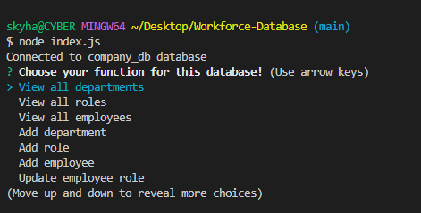

# Work Team Database

## Description
This Work Team Database uses Node.js, Inquirer and SQL to create a database storing information regarding a company's employees, wages, departments, roles and managers. Once ran using `node index.js` a user is prompted by a menu of options to choose from, including view all departments, all employees, the option to delete employees/departments/roles and so on. This application serves as an introduction to SQL and how Node works to run these database commands locally. 

The motivation behind building this application was to better understand SQL queries, seeds schemas and so forth. Alongside this it helped to better display how Java functions can work with SQL to act as a sort of middleware between the database and the user.

The hardest part of this application was understanding how queries work with SQL, and similarly how particular SQL can be when creating/modifying databases. Fortunately the error prompts are pretty enlightening in that regard and usually point in the right direction.

## Table of Contents
- [Installation](#installation)
- [Usage/Examples](#usage-and-video-example)
- [Credits](#credits)
- [License](#license)
- [Tests](#tests)
  
## Installation

The only requirement for this application to run is NodeJS and ensuring that both Inquirer and Node are up to date. This aplication uses SQL and may need a `.env` file with the users information for their SQL login to work.

Aside from that installing the packages listed in the .json file will allow this application to run, as is always the case start with `npm i`.

## Usage and Video Example
  
[Walkthrough video.](https://drive.google.com/file/d/1cHJAo3ZfrgyrLk0ydWqnMy86QL7nvO_V/view?usp=share_link)  

When first starting the node server a user will be prompted with these options

Here are some examples of the displayed information from some of the database options

## Credits
For this assignment I had to refer back to a lot of course work, recorded lectures and some solved solutions as I missed the past two weeks of class due to a family emergency. My tutor `Andres Jimenez` helped me through a lot of setting up this project and better understandiing SQL queries/keys and so on.

- A lot of stackoverflow for debugging [https://stackoverflow.com/](https://stackoverflow.com/)

- W3Schools for SQL information [https://www.w3schools.com/sql/](https://www.w3schools.com/sql/)

- TutorialsPoint for more SQL information [https://www.tutorialspoint.com/sql/index.htm](https://www.tutorialspoint.com/sql/index.htm)

## License
MIT License
 
Copyright (c) [2022] [Sky Hamilton Texier]
 
Permission is hereby granted, free of charge, to any person obtaining a copy
of this software and associated documentation files (the "Software"), to deal
in the Software without restriction, including without limitation the rights
to use, copy, modify, merge, publish, distribute, sublicense, and/or sell
copies of the Software, and to permit persons to whom the Software is
furnished to do so, subject to the following conditions:
 
The above copyright notice and this permission notice shall be included in all
copies or substantial portions of the Software.
 
THE SOFTWARE IS PROVIDED "AS IS", WITHOUT WARRANTY OF ANY KIND, EXPRESS OR
IMPLIED, INCLUDING BUT NOT LIMITED TO THE WARRANTIES OF MERCHANTABILITY,
FITNESS FOR A PARTICULAR PURPOSE AND NONINFRINGEMENT. IN NO EVENT SHALL THE
AUTHORS OR COPYRIGHT HOLDERS BE LIABLE FOR ANY CLAIM, DAMAGES OR OTHER
LIABILITY, WHETHER IN AN ACTION OF CONTRACT, TORT OR OTHERWISE, ARISING FROM,
OUT OF OR IN CONNECTION WITH THE SOFTWARE OR THE USE OR OTHER DEALINGS IN THE
SOFTWARE.

